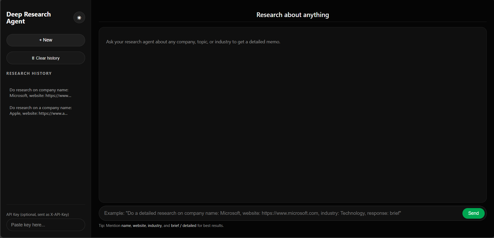

<p align="center">
  
</p>

<p align="center">
  
</p>

<h1 align="center">🚀 Deep Research Agent — Multi-Agent AI for Automated Research</h1>

<p align="center">
  A next-generation multi-agent system that performs complete company research with automated planning, web intelligence, analysis, validation, and memo generation — all inside a premium ChatGPT-style interface.
</p>

<p align="center">
  
  
  
  
  
</p>

---

## 🌟 Overview

The **Deep Research Agent** turns a plain natural-language question into a **polished, analyst-grade research memo** using a chain of intelligent LLM agents.

**It performs:**

- 🧠 Intelligent task planning  
- 🌐 Automated web & document research  
- 🔍 Evidence verification  
- 🗂️ Content curation & structuring  
- ✍️ Memo drafting using formatting standards  
- 💬 Beautiful animated ChatGPT-style UI  

Everything happens **automatically** through multi-agent reasoning.

---

## 🎨 UI Preview (Frontend)

<p align="center">
  
</p>

---

## 🧩 Key Features

### 🔹 Multi-Agent Intelligence (LangGraph)
- **Planner Agent** → breaks the query into structured subtasks  
- **Analyst Agent** → contextual web search + extraction  
- **Curator Agent** → validation & cleanup  
- **Editor Agent** → polished research memo  

### 🔹 Modern ChatGPT-Style Interface
- Gradient chat bubbles  
- Smooth animations  
- “Agent is thinking…” indicators  
- Auto-scroll  
- Markdown support  
- Light/Dark Theme  
- Chat history  

### 🔹 High-Quality Research Output
- Analyst-grade summaries  
- Structured sections  
- Clean typography  
- Evidence-based writing  
- Future PDF/DOCX export  

---

## 🧠 System Architecture

```mermaid
graph TD
    U[User / Recruiter] --> UI[React + Vite<br/>Chat Interface]
    UI --> API[FastAPI Backend<br/>/research Endpoint]

    API --> LG[LangGraph<br/>Multi-Agent Engine]

    LG --> P[Planner Agent<br/>Task Breakdown]
    LG --> A[Analyst Agent<br/>Web Research + Extraction]
    LG --> C[Curator Agent<br/>Validation & Cleanup]
    LG --> E[Editor Agent<br/>Final Memo Generation]

    A --> WEB[Web Scrapers / Search APIs]
    A --> RAG[RAG / VectorDB]
    C --> RAG
    RAG --> LG

    E --> MEMO[Final Report<br/>(Markdown)]
    MEMO --> UI


## 📦 Installation

### 1️⃣ Clone Repository
```bash
git clone https://github.com/Anshultiwari07/Deep-Research-Agent.git
cd Deep-Research-Agent

# Backend 
pip install -r requirements.txt
uvicorn main:app --reload

Backend → http://127.0.0.1:8000

# Frontend
cd frontend
npm install
npm run dev

Frontend → http://127.0.0.1:5173

## 🔑 Environment Variables

Create a `.env` file in the project root:

```env
HF_API_KEY=your_key
TAVILY_API_KEY=your_key

<p align="center"><b>Built by Anshul Tiwari</b></p>


